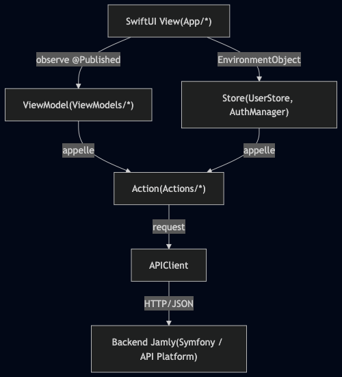
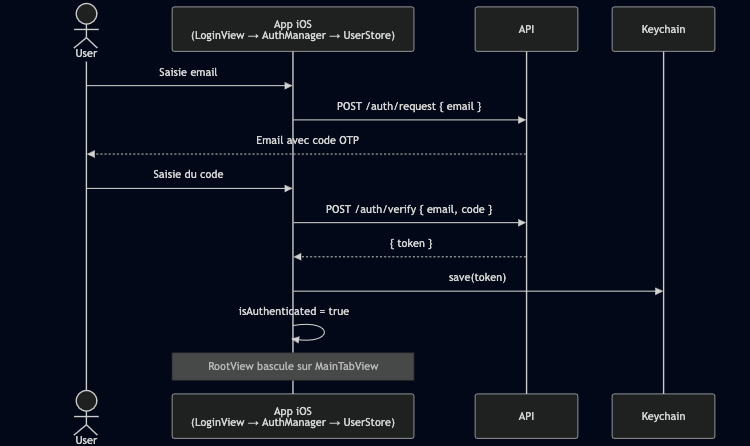
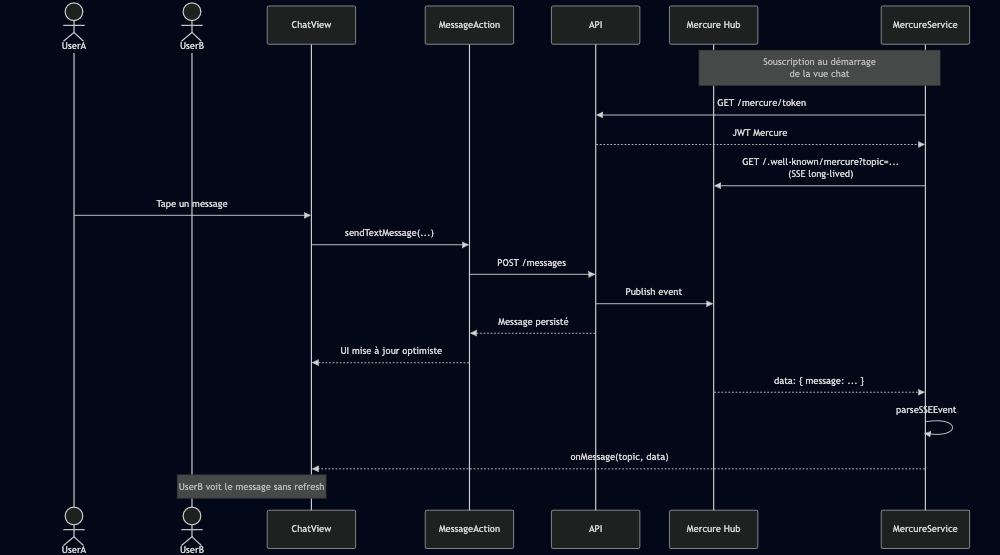
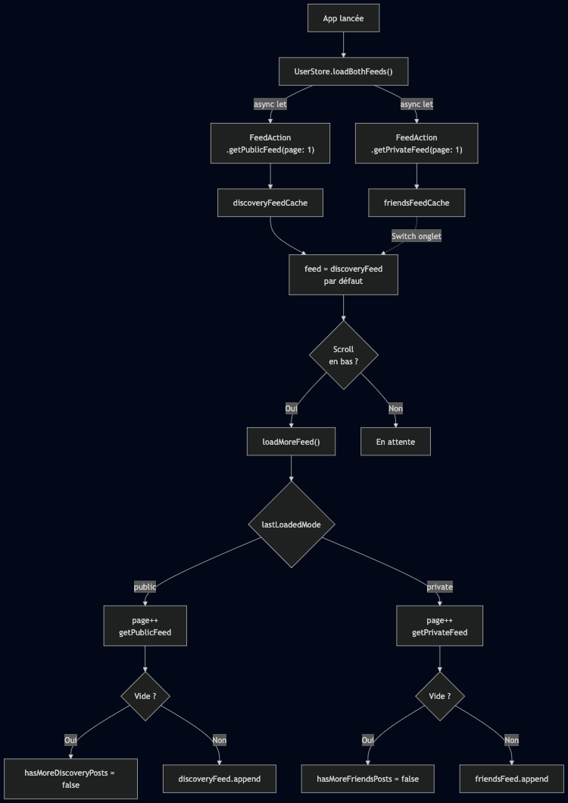

# Architecture

Ce document détaille les choix d'architecture du client Jamly et les flux
métier les plus structurants. Il complète la section « Architecture » du
[README](../README.md) qui reste volontairement haut niveau.

## Vue d'ensemble des couches

Jamly suit une architecture **MVVM avec un Store global**, sans framework
externe. Chaque couche a une responsabilité unique et communique uniquement
avec la couche immédiatement inférieure.

| Couche | Rôle | Exemples |
|---|---|---|
| **View** | Affichage SwiftUI, aucun appel réseau | [`HomeFeedView`](../jamly/App/Home/), [`ChatDetailView`](../jamly/App/Chats/) |
| **ViewModel** | Orchestration locale d'une feature, état `@Published` | [`ChatsViewModel`](../jamly/ViewModels/Chat/ChatsViewModel.swift), [`SearchViewModel`](../jamly/ViewModels/Search/SearchViewModel.swift) |
| **Store** | État global partagé via `@EnvironmentObject` | [`UserStore`](../jamly/Stores/UserStore.swift), [`AuthManager`](../jamly/Utils/AuthManager.swift) |
| **Action** | Namespace de fonctions statiques par domaine API | [`UserActions`](../jamly/Actions/Users/UserAction.swift), [`FeedAction`](../jamly/Actions/Feed/FeedAction.swift) |
| **APIClient** | Client HTTP générique (auth, JSON, erreurs) | [`APIClient`](../jamly/Networking/APIClient.swift) |

## Flux d'authentification (OTP + JWT)

L'auth se fait en deux temps : envoi d'un code OTP par mail, puis échange
du code contre un JWT. Le token est ensuite persisté dans le Keychain.

**Détail côté code** :

- Les deux appels HTTP sont portés par [`AuthActions`](../jamly/Actions/Auth/LoginAction.swift)
  (`request(email:)` puis `verify(email:code:)`).
- En cas de succès du `verify`, [`AuthManager.login(token:)`](../jamly/Utils/AuthManager.swift)
  délègue à [`UserStore.setToken(_:)`](../jamly/Stores/UserStore.swift), qui à
  son tour persiste le token via [`SecureStore.save(token:)`](../jamly/Stores/SecureStore.swift).
- Le changement de `isAuthenticated` est observé par `RootView` qui bascule
  automatiquement sur l'interface principale.

**Fichiers concernés** :
- [`Actions/Auth/LoginAction.swift`](../jamly/Actions/Auth/LoginAction.swift)
- [`Utils/AuthManager.swift`](../jamly/Utils/AuthManager.swift)
- [`Stores/UserStore.swift`](../jamly/Stores/UserStore.swift)
- [`Stores/SecureStore.swift`](../jamly/Stores/SecureStore.swift)

### Auto-restauration au démarrage

Au lancement, `UserStore.init` lit le token depuis le Keychain. S'il existe,
`isAuthenticated` est positionné à `true` et `initialize()` charge le profil
utilisateur via `UserActions.fetchMe()`. Aucun re-login n'est demandé.

### Déconnexion automatique sur 401

Si une requête renvoie `401`, `APIClient` :
1. supprime le token du Keychain,
2. poste la notification `.didReceiveUnauthorized`,
3. lève `APIError.unauthorized`.

`UserStore` et `AuthManager` écoutent cette notification et appellent `logout()`
qui vide l'état local. `RootView` rebascule sur l'écran de login.

## Flux de messagerie temps réel

La messagerie utilise **Mercure** (Server-Sent Events) pour la livraison
temps réel. L'envoi reste un POST HTTP classique.

**Fichiers concernés** :
- [`Actions/Chat/MessageAction.swift`](../jamly/Actions/Chat/MessageAction.swift)
- [`Services/Mercure/MercureService.swift`](../jamly/Services/Mercure/MercureService.swift)
- [`Services/Mercure/MercureConfig.swift`](../jamly/Services/Mercure/MercureConfig.swift)
- [`Models/Message.swift`](../jamly/Models/Message.swift)

**Spécificités du parsing SSE** : Mercure envoie des événements terminés par `MercureService` maintient un buffer pour gérer les fragments qui
arrivent à cheval entre deux callbacks `didReceive data:`.

## Chargement et pagination du feed

Le feed principal a la particularité d'exposer **deux sous-feeds** (Discovery
public et Friends privé) que l'utilisateur peut basculer instantanément.
Chacun a son cache et sa pagination indépendante.

**Fichiers concernés** :
- [`Stores/UserStore.swift`](../jamly/Stores/UserStore.swift)
- [`Actions/Feed/FeedAction.swift`](../jamly/Actions/Feed/FeedAction.swift)

**Points clés** :
- **Chargement parallèle au boot** : `async let` charge les deux feeds en
  même temps pour minimiser le temps de splash.
- **Basculer ≠ recharger** : changer d'onglet n'appelle pas l'API tant que
  le cache est valide.
- **Pull-to-refresh** : `forceRefresh: true` annule la tâche en cours via
  `feedLoadTask?.cancel()` avant de relancer.
- **Pagination par offset** : pas par curseur. Une réponse vide marque la
  fin du feed et bloque tout chargement ultérieur.

## Gestion des erreurs

Le projet adopte un pipeline d'erreurs en deux étages :

| Cas backend | `APIError` levée | `AppError` exposée à la View |
|---|---|---|
| 200-299 + body décodable | _aucune_ | _aucune_ |
| 401 Unauthorized | `.unauthorized` + logout auto | `.unauthorized` |
| Autres 4xx/5xx | `.serverError(code, data)` | `.serverError` |
| Timeout / pas de réseau | `.networkError(Error)` | `.networkError` |
| URL invalide | `.invalidURL` | `.unknown` |
| Décodage JSON KO | `.decodingFailed` | `.unknown` |

**Particularité API Platform** : les erreurs métier sont remontées avec un
champ `detail` en JSON. `APIError.errorDescription` extrait ce champ pour
afficher un message localisé au plus près de ce que dit le backend.

**Fichiers concernés** :
- [`Networking/APIError.swift`](../jamly/Networking/APIError.swift)
- [`Networking/APIClient.swift`](../jamly/Networking/APIClient.swift)
- [`Stores/UserStore.swift`](../jamly/Stores/UserStore.swift) (définit `AppError`)

## Concurrence et `@MainActor`

- **Tous les Stores et ViewModels** sont annotés `@MainActor` : leurs
  `@Published` ne peuvent pas être mutés depuis un thread de fond, ce qui
  élimine une classe entière de warnings runtime SwiftUI.
- **`APIClient.request<T>`** n'est pas `@MainActor` (volontairement) : l'appel
  réseau s'exécute sur un thread de pool. C'est l'appelant qui assure le
  retour main-thread via son propre acteur.
- **Mercure (`URLSessionDataDelegate`)** : les callbacks sont `nonisolated` ;
  un `Task { @MainActor in ... }` est posé à l'intérieur pour mettre à jour
  l'état observable.