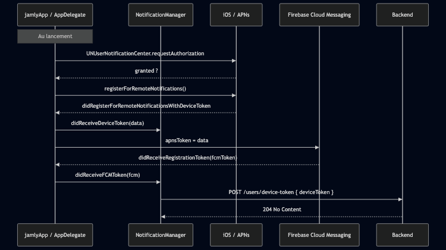
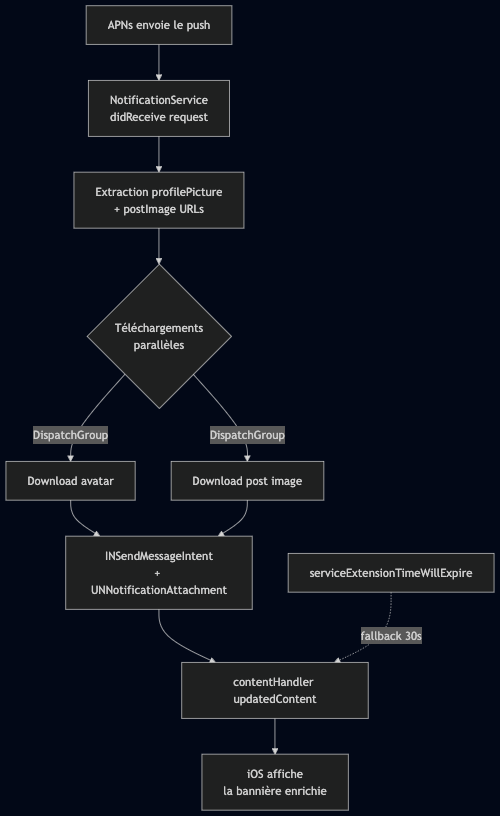
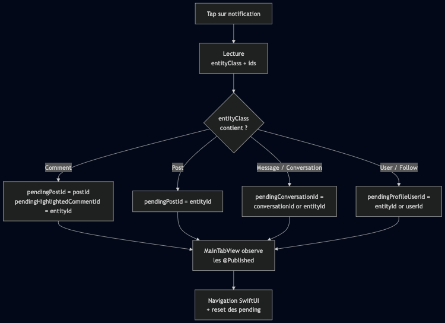

# Notifications push

Les notifications push couvrent un flux **transverse** qui passe par APNs,
Firebase Cloud Messaging (FCM), la `NotificationServiceExtension` iOS,
l'`AppDelegate`, un singleton `NotificationManager` et plusieurs vues
SwiftUI. Ce document décrit le cycle complet, de la demande de permission
jusqu'au deep link déclenché par un tap utilisateur.

## Vue d'ensemble des acteurs

| Composant | Rôle |
|---|---|
| [`AppDelegate`](../jamly/AppDelegate.swift) | Pont UIKit ↔ APNs, délégué Firebase, délégué `UNUserNotificationCenter` |
| [`NotificationManager`](../jamly/App/Notifications/NotificationManager.swift) | Singleton qui orchestre la permission, la propagation du token et le routage des payloads |
| [`NotificationService`](../NotificationServiceExtension/NotificationService.swift) | Extension iOS qui modifie le contenu de la notification **avant** son affichage (image de profil, image du post) |
| [`MainTabView`](../jamly/App/Tabs/MainTabView.swift) | Consomme les `pending*` IDs publiés par le `NotificationManager` pour effectuer la navigation |
| [`ChatsViewModel`](../jamly/ViewModels/Chat/ChatsViewModel.swift) | Écoute `.messageNotificationReceived` pour incrémenter les compteurs non-lus sans recharger l'inbox |

## Setup et enregistrement du device

Le device doit s'enregistrer auprès d'APNs et envoyer son token au backend.
Ce setup se fait une fois au démarrage, et après chaque login.



**Particularités** :

- L'app **ne fait pas le tri** entre token APNs natif et token FCM : les deux
  sont envoyés au backend via le même endpoint `/users/device-token`. C'est
  le backend qui choisit lequel utiliser selon sa stratégie d'envoi.
- Le token APNs et le FCM token sont **copiés automatiquement dans le
  presse-papier** au moment de leur réception (utile en debug).
- Si l'utilisateur se connecte **après** avoir reçu son token, `AuthManager.login(_:)`
  rappelle `NotificationManager.sendDeviceTokenToServer()` pour ré-envoyer
  le token désormais associé à un utilisateur authentifié.

## Réception d'une notification

Trois callbacks différents sont déclenchés selon l'état de l'app au moment
où la notification arrive.

| État de l'app | Callback `AppDelegate` | Méthode `NotificationManager` |
|---|---|---|
| **Premier plan** | `userNotificationCenter(_:willPresent:withCompletionHandler:)` | `didReceiveNotification(userInfo)` |
| **Arrière-plan (silent push)** | `application(_:didReceiveRemoteNotification:fetchCompletionHandler:)` | `didReceiveNotification(userInfo)` |
| **Tap utilisateur** (app fermée ou en arrière-plan) | `userNotificationCenter(_:didReceive:withCompletionHandler:)` | `didTapNotification(userInfo)` |

**Choix de design** :

- En premier plan, on appelle `completionHandler([.banner, .sound, .badge])`
  pour **forcer l'affichage** même si l'app est ouverte. Sans cette option,
  iOS supprime la bannière par défaut.
- `didReceiveNotification` et `didTapNotification` sont annotés `@MainActor` :
  ils mutent des `@Published` qui pilotent la UI.

## Notification riche via la Service Extension

[`NotificationService`](../NotificationServiceExtension/NotificationService.swift)
est une **extension d'application** distincte du binaire principal. iOS la
réveille **avant** d'afficher la notification, lui laissant ~30 s pour
enrichir le contenu.



L'extension utilise une **Communication Notification** (`INSendMessageIntent`)
pour bénéficier du rendu type « iMessage » : avatar circulaire à gauche,
attribution claire de l'expéditeur. L'image du post (si présente) est
ajoutée comme `UNNotificationAttachment` et s'affiche à droite.

**Point clé** : l'extension a un budget de ~30 secondes. La méthode
`serviceExtensionTimeWillExpire()` est un filet de sécurité qui appelle
quand même `contentHandler` avec le contenu non enrichi pour éviter qu'iOS
ne supprime la notification.

## Deep linking : du tap à l'écran cible

Le `NotificationManager` expose **4 propriétés `@Published` optionnelles**,
appelées « pending » parce qu'elles décrivent une **navigation en attente
d'être consommée** par la UI :

| Propriété | Type | Utilisée pour |
|---|---|---|
| `pendingPostId` | `Int?` | Ouvrir le détail d'un post |
| `pendingHighlightedCommentId` | `Int?` | Épingler un commentaire en tête du post |
| `pendingProfileUserId` | `Int?` | Ouvrir le profil d'un utilisateur |
| `pendingConversationId` | `Int?` | Ouvrir une conversation précise |

Quand l'utilisateur tape sur une notification, [`NotificationManager.didTapNotification(_:)`](../jamly/App/Notifications/NotificationManager.swift)
inspecte le payload et positionne une (ou plusieurs) de ces propriétés
selon le type d'entité.



Côté `MainTabView`, chaque `pending*Id` est observé via `.onReceive` ; dès
qu'il devient non-nil, la vue cible est poussée dans la stack de navigation
puis l'ID est remis à `nil` pour éviter qu'une nouvelle navigation se
déclenche au prochain rendu.

**Pourquoi des `pending*` plutôt qu'une navigation directe ?** Parce que
le tap peut survenir **avant** que la `MainTabView` ne soit affichée (cas
de l'app lancée à froid depuis la notif). Stocker l'ID en attente permet à
la vue de récupérer la cible dès qu'elle s'abonne.

## Mise à jour temps réel de l'inbox

Quand une notification de nouveau message arrive **alors que l'app est
ouverte sur l'inbox**, on n'a pas besoin de recharger toute la liste : il
suffit d'incrémenter le compteur de la conversation concernée.

`NotificationManager.didReceiveNotification(_:)` poste la notification
interne `.messageNotificationReceived` avec le `conversationId` extrait du
payload. [`ChatsViewModel`](../jamly/ViewModels/Chat/ChatsViewModel.swift)
l'écoute et :

1. Cherche la conversation dans `conversations` par son `id`.
2. Si trouvée : reconstruit l'objet avec `unreadCount + 1` (les `Conversation`
   sont `Codable` immutables, d'où la reconstruction via `ConversationConfig`).
3. Si **pas** trouvée : recharge l'inbox complet pour faire apparaître la
   nouvelle conversation.

L'update est animé via `withAnimation { ... }` pour un feedback fluide à
l'écran.

## Contrat de payload

Le backend doit produire un payload APNs respectant le contrat suivant.
Les champs `entityClass` / `entityId` permettent au client de router le tap
correctement.

```json
{
  "aps": {
    "alert": {
      "title": "Alex",
      "body": "a commenté ton post"
    },
    "sound": "default",
    "badge": 3,
    "mutable-content": 1
  },
  "type": "comment",
  "entityClass": "App\\Entity\\Comment",
  "entityId": "42",
  "postId": "17",
  "userId": "8",
  "conversationId": "5",
  "profilePicture": "https://cdn.jamly.app/users/8/avatar.jpg",
  "postImage": "https://cdn.jamly.app/posts/17/front.jpg"
}
```

| Champ | Type | Présence | Rôle |
|---|---|---|---|
| `aps.alert.title` | string | obligatoire | Nom de l'expéditeur (réutilisé dans `INPersonHandle`) |
| `aps.alert.body` | string | obligatoire | Corps de la notification |
| `aps.mutable-content` | `1` | **obligatoire** | Active la `NotificationServiceExtension` |
| `type` | string | optionnel | Catégorie sémantique (logué, non utilisé pour le routage) |
| `entityClass` | string | conseillé | Préfixé `App\Entity\` ; sert au routage du tap |
| `entityId` | string\|int | selon `entityClass` | ID de l'entité principale concernée |
| `postId` | string\|int | si `entityClass = Comment` | Post parent du commentaire |
| `userId` | string\|int | follow/like | Utilisateur acteur de l'événement |
| `conversationId` | string\|int | message | Conversation cible |
| `profilePicture` | URL | optionnel | Avatar pour la rich notification |
| `postImage` | URL | optionnel | Image attachée à droite de la rich notification |

**Tolérance aux types** : `NotificationManager.intFromAny(_:)` accepte
indifféremment `Int`, `String` ou `NSNumber` pour les IDs, car APNs/FCM
peuvent reformater les types au passage selon les providers.

## Côté Apple Developer

- **Capability « Push Notifications »** activée pour la target `jamly`.
- **Capability « Background Modes » → Remote notifications** pour recevoir
  les silent pushes.
- **`mutable-content: 1`** dans le payload pour réveiller la Service Extension.
- Un certificat APNs ou une clé `.p8` doit être configuré côté serveur
  (Firebase ou backend direct).
